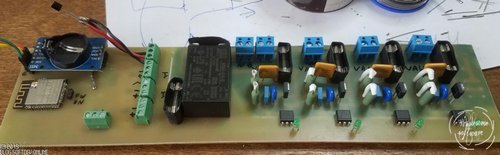
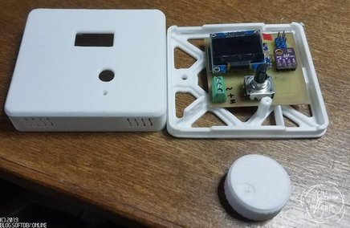

# water floor heater system

Complete and ready-to-use WiFi-enabled water floors heating system with remote sensors and 
controllers over 1-wire (One Wire) interface.

Uses: 
1. OLED 0.96" display (no-name China), 
2. ESP32 (as central controller),
3. ATMEGA328 (as slave remote thermostats placed on rooms walls).
4. BME280 sensors
5. TRIACs (for opening/closing water valve actuators)

Full assembly instructions with photos and detailed description (written currently into Russian lang):
Part1 (hardware): https://blog.softdev.online/index.php?controller=post&action=view&id_post=10

Part2 (software): https://blog.softdev.online/index.php?controller=post&action=view&id_post=11

